# AI Cover Letter Generator - System Architecture

## Overview

The AI Cover Letter Generator is a modern web application that leverages Google's Gemini 2.5 AI model through a secure N8N backend to create personalized cover letters. The system follows a client-server architecture with AI-powered content generation, providing a seamless user experience for job seekers.

## System Architecture

### High-Level Architecture Diagram

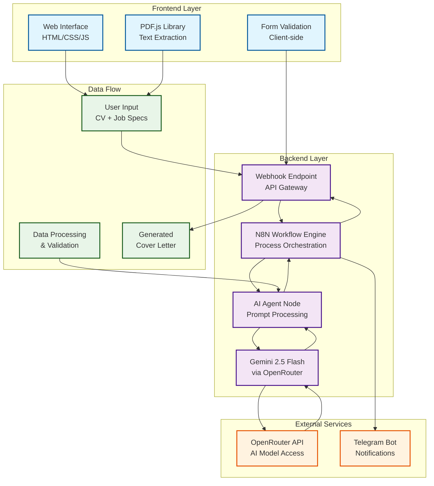

## Detailed Component Architecture

### Frontend Components

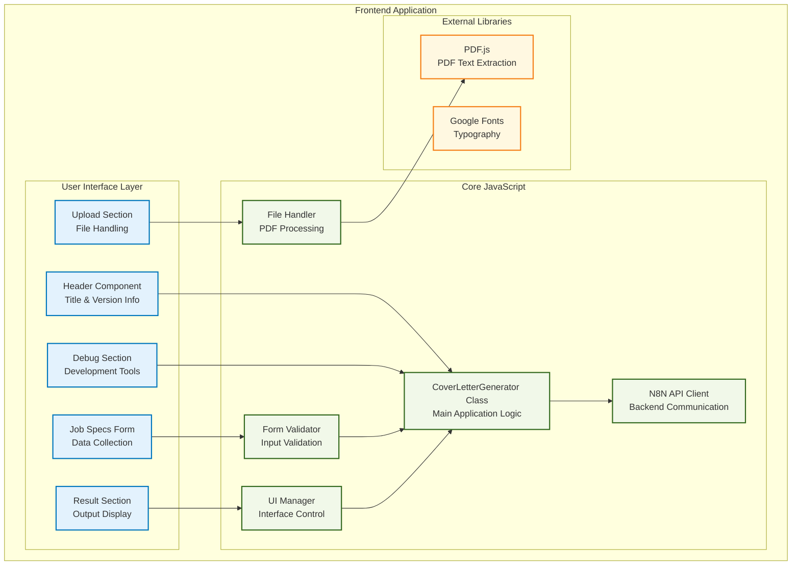

### N8N Workflow Architecture

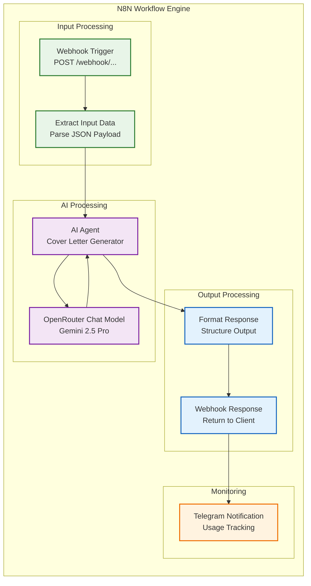

## Data Flow Architecture

### Complete Request-Response Flow

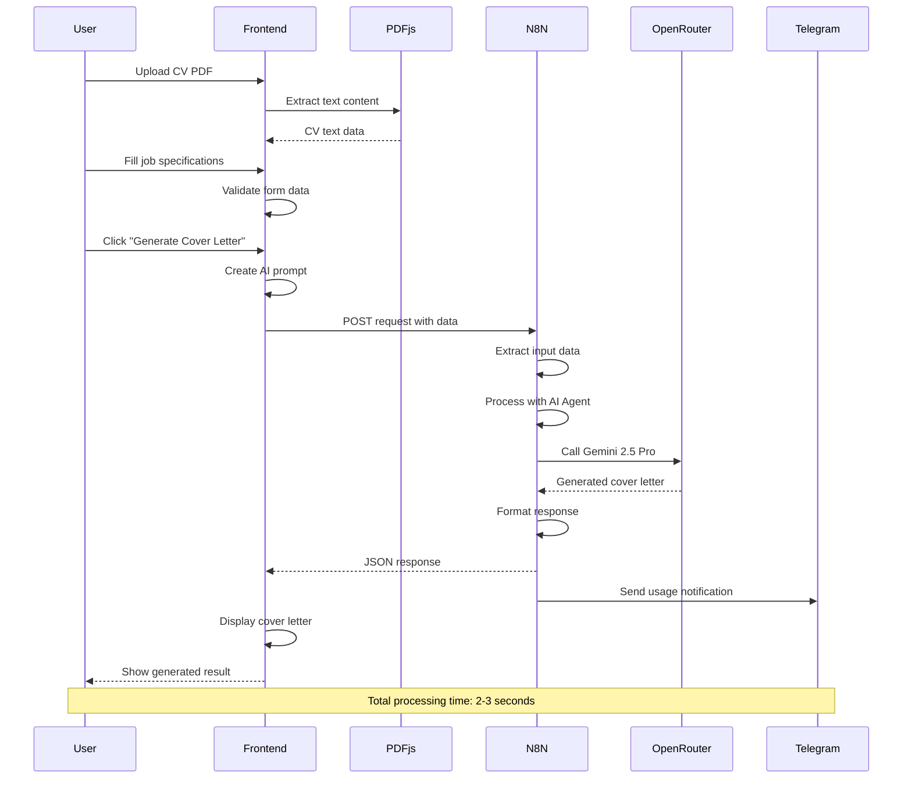

## Technology Stack

### Frontend Technologies
- **HTML5**: Semantic markup for accessibility
- **CSS3**: Modern styling with Flexbox/Grid and custom properties
- **JavaScript ES6+**: Class-based architecture with async/await
- **PDF.js**: Client-side PDF text extraction
- **Google Fonts**: Inter font family for typography

### Backend Technologies
- **N8N**: Workflow automation and API orchestration
- **OpenRouter API**: AI model access and management
- **Gemini 2.5 Flash**: Google's advanced language model
- **Telegram Bot API**: Usage monitoring and notifications

### Infrastructure
- **GitHub Pages**: Static site hosting
- **HTTPS**: Secure communication
- **CORS**: Cross-origin resource sharing
- **Webhooks**: Real-time API communication

## Security Architecture

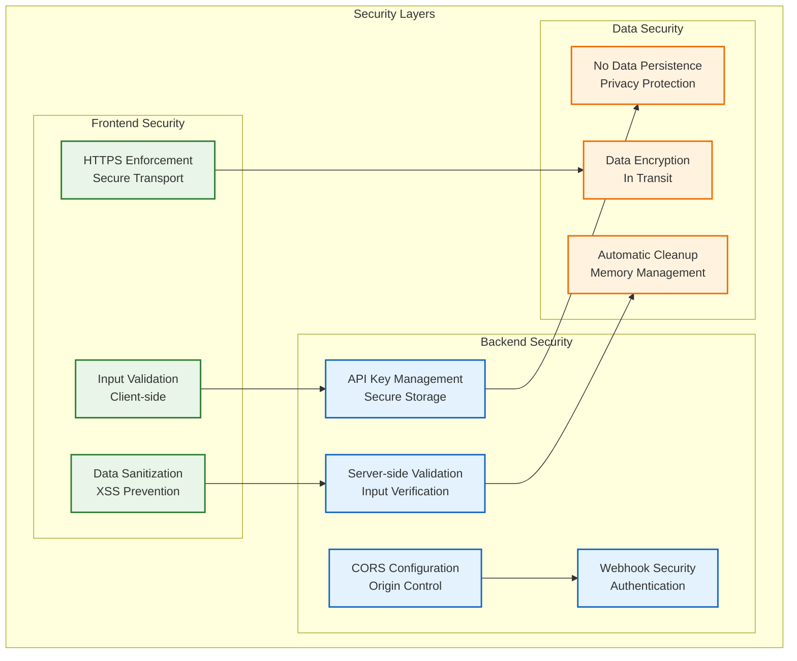

## Performance Architecture

### Optimization Strategies

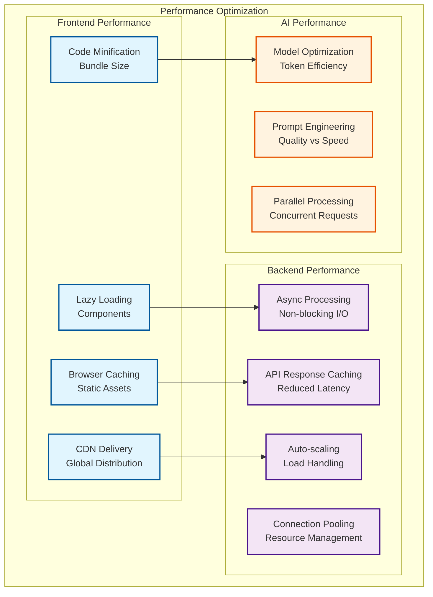

## Deployment Architecture

### Current Deployment

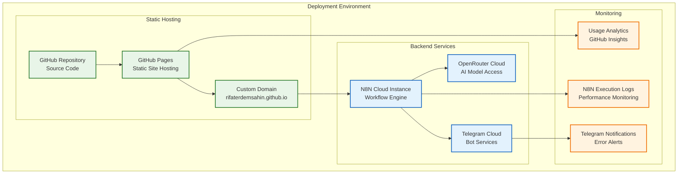

## Error Handling Architecture

### Comprehensive Error Management

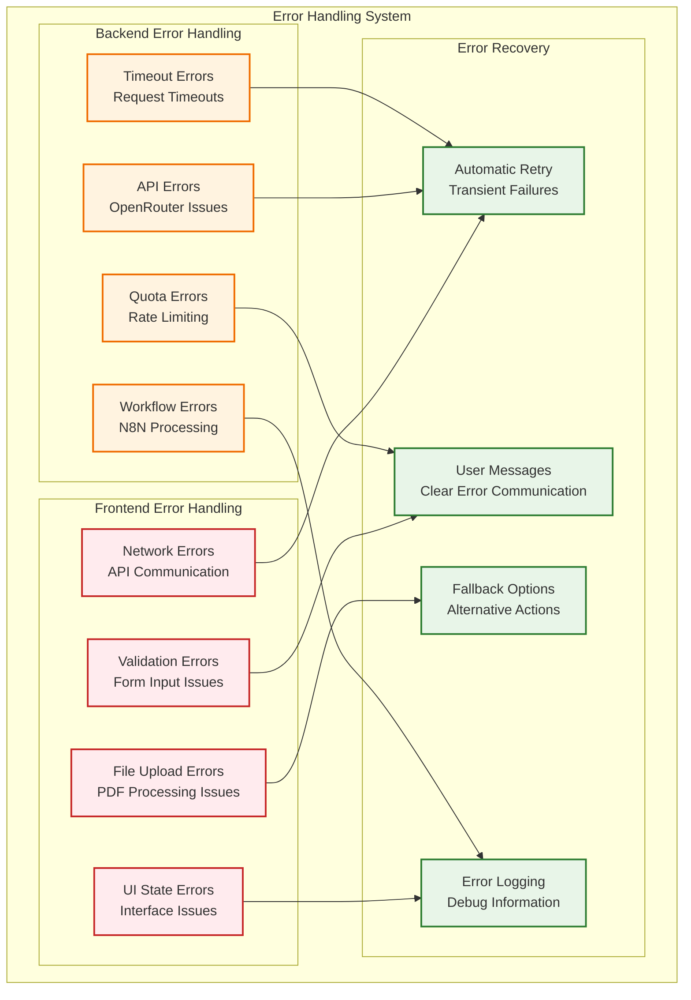

## Scalability Considerations

### Future Architecture Enhancements

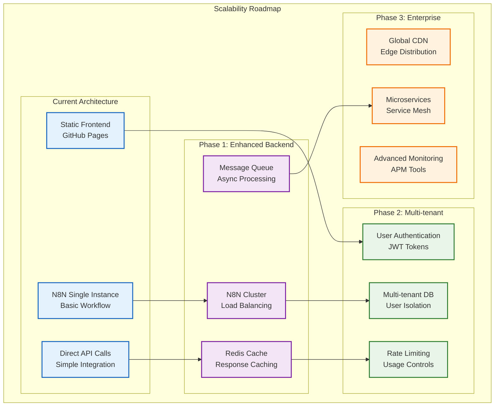

## API Architecture

### Request/Response Specifications

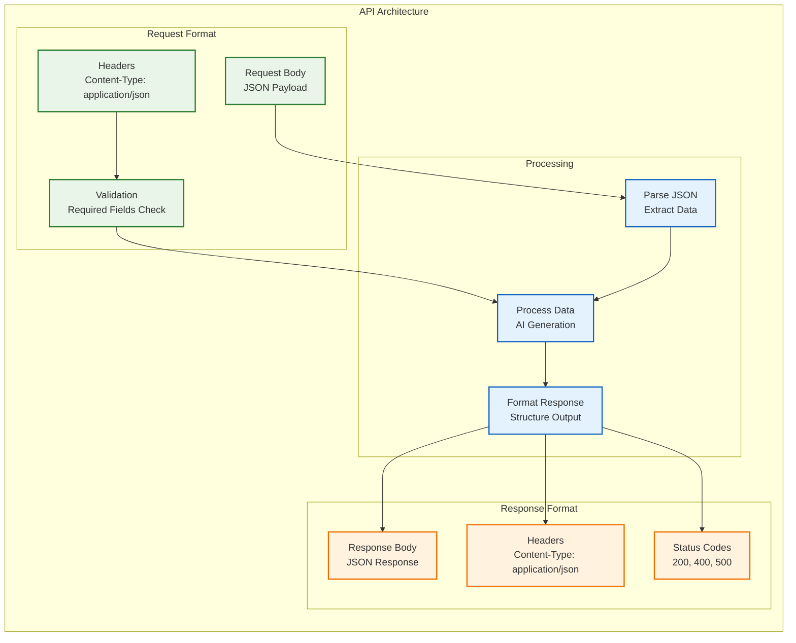

## Development Workflow

### CI/CD Pipeline

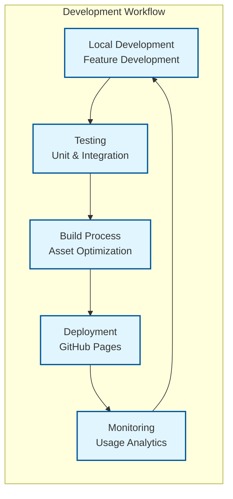

## Key Architectural Decisions

### 1. **N8N Backend Choice**
- **Decision**: Use N8N instead of traditional backend frameworks
- **Rationale**: 
  - Visual workflow design for easy maintenance
  - Built-in API management and webhook handling
  - Secure credential management
  - Rapid prototyping and iteration
  - Cost-effective for small to medium scale

### 2. **Client-side PDF Processing**
- **Decision**: Extract PDF text on the frontend using PDF.js
- **Rationale**:
  - Reduces server load and processing time
  - Better user experience with immediate feedback
  - Lower bandwidth usage
  - Privacy protection (files stay on client)

### 3. **OpenRouter Integration**
- **Decision**: Use OpenRouter instead of direct Gemini API
- **Rationale**:
  - Unified API for multiple AI models
  - Better rate limiting and quota management
  - Cost optimization through model comparison
  - Simplified API key management

### 4. **Static Frontend Hosting**
- **Decision**: Deploy on GitHub Pages instead of dynamic hosting
- **Rationale**:
  - Zero hosting costs
  - Automatic HTTPS and CDN
  - Easy deployment through Git
  - High availability and performance

### 5. **No Database Architecture**
- **Decision**: Stateless application without persistent storage
- **Rationale**:
  - Simplified architecture and maintenance
  - Better privacy and data protection
  - Lower operational costs
  - Easier scaling and deployment

## Performance Metrics

### Current Performance Targets
- **Response Time**: < 3 seconds for cover letter generation
- **Uptime**: 99.9% availability
- **File Size Limit**: 10MB for PDF uploads
- **Concurrent Users**: 50+ simultaneous requests
- **Error Rate**: < 1% failure rate

### Monitoring and Analytics
- **Frontend**: GitHub Pages analytics and browser console logging
- **Backend**: N8N execution logs and Telegram notifications
- **API**: OpenRouter usage tracking and quota monitoring
- **User Experience**: Real-time error reporting and success metrics

## Conclusion

The AI Cover Letter Generator architecture demonstrates a modern approach to AI-powered web applications, combining:

1. **Simplicity**: Minimal infrastructure with maximum functionality
2. **Security**: Secure API key management and data privacy protection
3. **Scalability**: Architecture designed for future growth and enhancement
4. **Performance**: Optimized for speed and user experience
5. **Cost-effectiveness**: Minimal operational costs with maximum value

This architecture provides a solid foundation for the current application while maintaining flexibility for future enhancements and scaling requirements.

---

*Last Updated: January 27, 2025*
*Architecture Version: 1.0*
